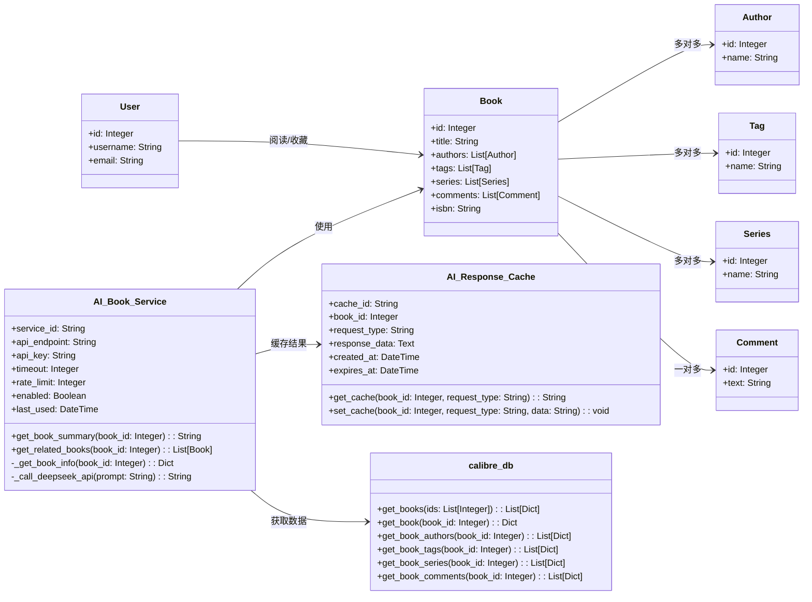
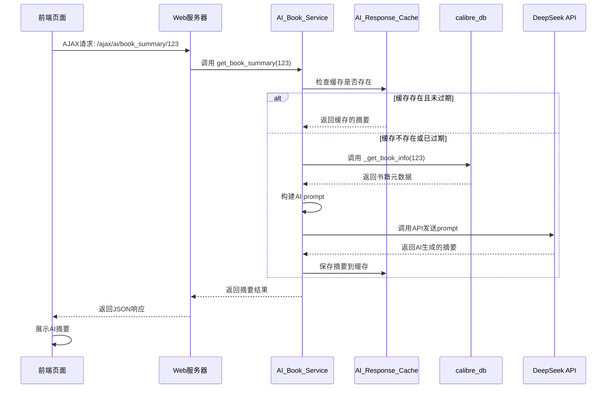
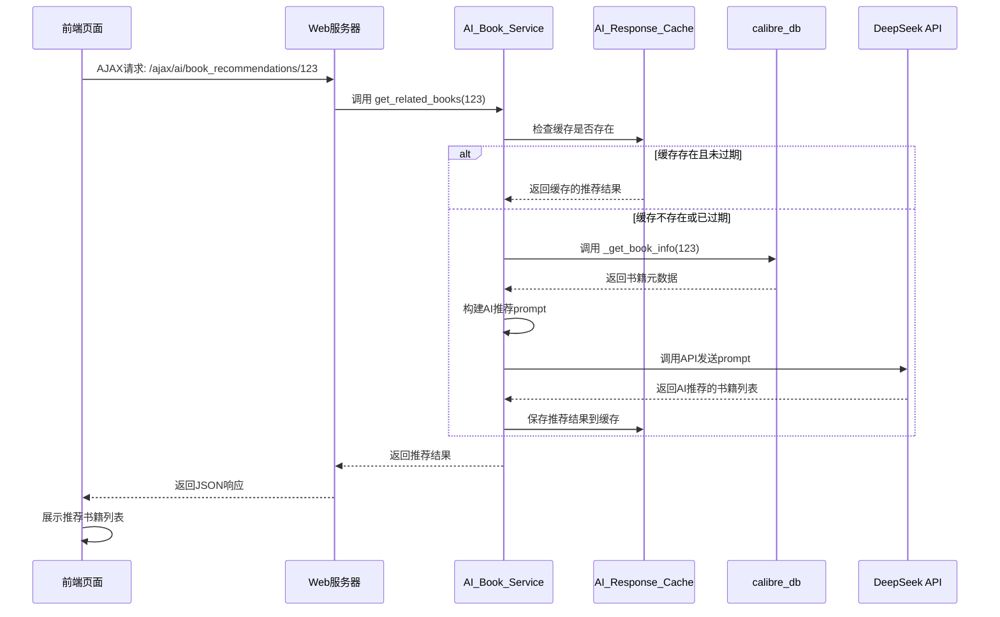

# AI模块UML类图和流程顺序图

## 1. UML类图

## 2. 核心流程顺序图

### 2.1 书籍AI摘要生成流程

### 2.2 相关书籍推荐流程

## 3. 图表说明

### 3.1 UML类图说明

UML类图展示了AI模块的核心类及其关系：

1. **核心实体**：
   - `AI_Book_Service`：AI书籍服务的核心类，提供书籍摘要生成和相关书籍推荐功能

2. **关联实体**：
   - `Book`：书籍类，包含书籍的基本信息和关联关系
   - `Author`、`Tag`、`Series`、`Comment`：与书籍相关的实体类
   - `User`：用户类，与书籍有阅读/收藏关系

3. **辅助类**：
   - `AI_Response_Cache`：AI响应缓存类，用于缓存AI生成的结果，提高性能
   - `calibre_db`：数据库访问类，用于获取书籍元数据

4. **关系**：
   - `AI_Book_Service` 使用 `Book` 实体的数据
   - `AI_Book_Service` 与 `AI_Response_Cache` 交互以缓存结果
   - `AI_Book_Service` 通过 `calibre_db` 获取书籍元数据
   - `Book` 与 `Author`、`Tag`、`Series` 是多对多关系
   - `Book` 与 `Comment` 是一对多关系
   - `User` 与 `Book` 有阅读/收藏关系

### 3.2 核心流程顺序图说明

1. **书籍AI摘要生成流程**：
   - 前端发起AJAX请求获取书籍摘要
   - Web服务器调用AI服务的`get_book_summary`方法
   - AI服务先检查缓存，如果缓存存在且未过期则直接返回
   - 如果缓存不存在或已过期，则获取书籍元数据，构建prompt，调用DeepSeek API
   - 将API返回的摘要保存到缓存，然后返回给前端
   - 前端展示AI生成的摘要

2. **相关书籍推荐流程**：
   - 前端发起AJAX请求获取相关书籍推荐
   - Web服务器调用AI服务的`get_related_books`方法
   - AI服务先检查缓存，如果缓存存在且未过期则直接返回
   - 如果缓存不存在或已过期，则获取书籍元数据，构建推荐prompt，调用DeepSeek API
   - 将API返回的推荐结果保存到缓存，然后返回给前端
   - 前端展示推荐的书籍列表

这些图表清晰地展示了AI模块的类结构和核心流程，有助于理解AI模块的设计和工作原理。